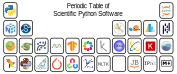
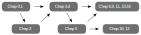

# Scientific Computing for Chemists with Python

#### An Introduction to Programming in Python with Chemical Applications

*Scientific computing* utilizes computers to aid in scientific tasks such as data processing and digital simulations among others. The well-developed field of computational chemistry is part of scientific computing and focuses on utilzing computings to simulate chemical phenomena and calculate properties. However, there is less focus in the field of chemistry on the data processing side of computing, so this book strives to fill this void by introducing the reader to tools and methods for processing, visualizing, and analyzing chemical data. The tools employed in this book are the powerful and popular combination of Jupyter notebooks and the Python programming language. No background beyond first-year college chemistry and occasionally some very basic spectroscopy (for advanced chapters) is assumed for most of this book, so this book starts with a brief primer on Jupyter notebooks in chapter 0 and computer programming with Python in chapters 1 and 2. If you already have background in these tools, feel free to skip ahead. Python and Jupyter were chosen for a variety of reasons including that they are:

- Relatively easy to use and learn
- Powerful and well-suited for solving chemical problems
- Free, open-source software
- Cross platform (e.g., runs on Windows, macOS, and Linux)
- Supplimented with numerous specialized libraries for handeling specific types of data or problems (e.g., machine learning)
- Supported by a helpful and welcoming community

Learning to use a number of popular Python scientific libraries to solve chemical problems is one of the themes of this book. A Python library can be thought of as a tool pack with premade functions for performing common tasks in scientific data processing, analysis, and visualization. For example, the matplotlib library provides a variety of functions for creating a wide range of plots while the SciPy library contains functions for tasks such as Fourier transforming data and finding peaks in spectra.

## Organization of Book

This book is organized in order of more fundamental topics first, but not every earlier chapter is a prerequisite for all subsequent chapters. Chapter 0 provides a quick introduction to the Jupyter notebook and chapters 1-2 provide background on the Python programming language. Anyone who already knows Python can skim or skip past these two chapters. Chapter 3 introduces plotting and visualization, and chapter 4 covers the NumPy library. Both of these chapters are used heavily in this book and should not be bypassed. The pandas library is covered in chapter 5 which is used in some subsequent chapters, but not all. This library adds functionality and extra ease-of-use to NumPy. Anyone looking to streamline their schedule could skip this chapter, but be aware that it is heavily utilized in chapters 10 and 12. However, chapters 10 and 12 should be largely readable by someone who is not familiar with pandas or at least has read sections 5.1-5.2. Chapters beyond chapter 5 are mostly applications or cover libraries for very specific applications such as image processing or machine learning. Chapters 6-16 are designed to be modular, so after getting through chapters 0-5, these subsequent chapters can be covered in any order depending up the reader's needs and interests. 

Below is a listing with brief descriptions of the chapters.

| Chapter Number | Description |
|:-----:  | :---------- |
|Chapter 0| Short introduction to installing and using Jupyter notebooks |
|Chapter 1| Core Python programming skills |
|Chapter 2| Intermediate Python programming skills - this chapter contains many useful topics but may be skipped over and returned to as needed for the impatient reader |
|Chapter 3| Matplotlib plotting library for visualization of data and results |
|Chapter 4| NumPy library which is the foundation of much of the scientific Python ecosystem |
|Chapter 5| Pandas data analysis library |
|Chapter 6| Basic signal processing in Python including finding peaks, smoothing data, and fitting/interpolation among other topics |
|Chapter 7| Image processing using the NumPy and scikit-image libraries |
|Chapter 8| Symbolic math and other more advanced mathematics in Python |
|Chapter 9| Simulating physical and chemical processes in Python |
|Chapter 10| Seaborn plotting library |
|Chapter 11| NMR processing with NMRglue |
|Chapter 12| Machine learning using the scikit-learn library |
|Chapter 13| Writing Python scripts using Spyder and running them from the command line |
|Chapter 14| Using functions from the `scipy.optimize` module to perform minimizations, curve fitting, and root finding |
|Chapter 15| Cheminformatics with RDKit |
|Chapter 16| Bioinformatics with Biopython and Nglview |

One of the goals of this book is to provide a streamlined introduction to Python and its scientific libraries in order to allow the reader to start applying these new skills to chemistry as quickly as possible. As a result, not all topics covered in a typical computer science course on Python are included here. Instead, the most relevant topics to chemistry are covered along with a selection of scientific libraries not likely taught in most Python courses. Another difference between this book and a typical computer science course on Python is that many computer science courses would have students write and save code as text files and run them from the command line. In contrast, this book assumes that the reader is running his or her code in a Jupyter notebook, as described in chapter 0, which is an ideal environment for scientific data analysis. The Jupyter notebook provides immediate feedback to the user, convenient graphical outputs, is shareable, and is simpler to use than running Python scripts from the command line. For those students who wish to continue on to run Python scripts from the command line, chapter 13 provides a brief introduction to this process. In an effort to make this text usable in a wide range of courses, there is little in-depth analysis of the data. This book instead focuses more on how to work with the data and leaves the analysis to the individual instructors.

## Chapter and Exercise Data

Any data file(s) refered to in the chapters or end-of-chapter exercises can be found in the [data](https://github.com/weisscharlesj/SciCompforChemists/tree/master/notebooks) folder in the same directory as the chapter's Jupyter notebook. Alternatively, you can download a zip file of the data for this chapter from [here](https://github.com/weisscharlesj/data_SciCompforChem) by selecting the appropriate chapter file and then clicking the **Download** button. The latter option is recommended for those who do not use Git or GitHub.

## Exercise Answers

Copies of exercise answer keys are available for instructors upon request. To optain copies, please [email](https://www.augie.edu/directory) the authuor using your school email address.

## Code and Software Versions

While great efforts have gone into ensuring that all the code in this book works as prescribed and all text and code are free of errors, some errors could exist. Additionally, some examples in this book are simplified for pedagogical reasons and may not be appropriate for research and other applications. It is the responsibility of the reader to check that their code is free of errors, behaves as required, and that the methods are appropriate for their applications.

The code in this version of the book has been most recently tested with the following software versions unless otherwise noted but will likely work with other versions.

- Python – 3.10.11
- NumPy – 1.25.2
- SciPy – 1.11.2
- Pandas – 2.0.3
- Matplotlib – 3.7.2
- Seaborn – 0.12.2
- Scikit-image – 0.21.0
- Scikit-learn – 1.3.0
- Sympy - 1.12
- NMRglue – 0.9
- Spyder – 5.4.2
- Biopython - 1.81
- Nglview - 3.0.6
- RDKit - 2023.3.3

## Acknowledgements

This book took a substantial time to write along with the time and effort in developing the curriculum. Thank you to those who supported and encouraged me along the way. Finally, thank you to the following people for proof reading or reporting errors. Reports of additional errors are welcome on GitHub or in an [email](https://www.augie.edu/directory).

- Wesley A. Deutscher helping collect some example data
- M. Roarke Tollar providing feedback and reporting typos in chapters 0 and 1
- Andrew Klose providing feedback and reporting typos in chapter 12 and an idea for an exercise
- Harrison Kuhn for identifying a code error in chapter 11
- nzjakemartin (GitHub handle) identifying a type in the weighted average equation 
- Paul A. Craig identifying a typo in the Python code
- Patrick Coppock providing feedback
- Zachary M. Schulte for providing feedback and reporting typos in chapter 14
- Yuthana Tantirungrotechai for reporting errors in chapter 6